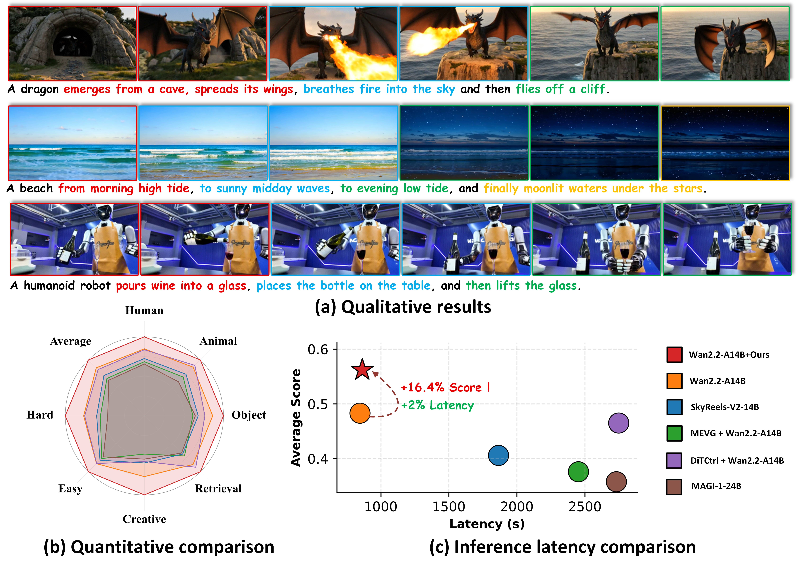
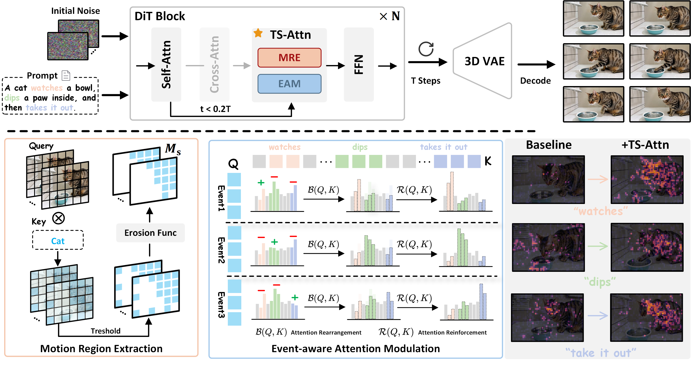

## TS-Attn: Temporal-wise Separable Attention for Multi-Event Video Generation

<a href="https://arxiv.org/pdf/2604.19473v1"></a> &ensp;
<a href="https://github.com/Hong-yu-Zhang/TS-Attn"></a> &ensp;

[Hongyu Zhang](https://github.com/Hong-yu-Zhang)<sup>1*</sup>, 
[Yufan Deng](#)<sup>1*</sup>, 
[Zilin Pan](#)<sup>1</sup>, 
[Peng-Tao Jiang](#)<sup>2</sup>, <br>
[Bo Li](#)<sup>2</sup>, 
[Qibin Hou](#)<sup>3</sup>, 
[Zhen Dong](#)<sup>4</sup>, 
[Zhiyang Dou](#)<sup>5</sup>, 
[Daquan Zhou](https://zhoudaquan.github.io/homepage.io/)<sup>1</sup>

> <sup>1</sup>Peking University  &ensp;
<sup>2</sup>vivo BlueImage Lab  &ensp;
<sup>3</sup>Nankai University  &ensp;
<sup>4</sup>University of California, Santa Barbara  &ensp;
<sup>5</sup>The University of Hong Kong
> 
> ICLR 2026




**TS-Attn** is a novel, training-free attention mechanism that dynamically rebalances attention along the temporal dimension, enabling **temporal awareness and global coherence** in multi-event scenarios with **a single forward pass**.


## 🔥 News
* `[2026.04.20]`  🔥 We have released the code for TS-attn, including support for tasks such as text-to-video and image-to-video. More I2V examples coming in 5 days.
* `[2026.01.26]`  🔥 Our paper is accepted by ICLR 2026!

## 🎥 Demo


## 🗓️ Todo List
- [x] Release code of TS-Attn on Wan2.2-T2V-A14B
- [x] Release code of TS-Attn on Wan2.2-I2V-A14B
- [] Release code of TS-Attn on Wan2.1-T2V-14B


## 🛠️ Dependencies and Installation

Install the dependencies:

```bash
conda create -n TS-Attn python=3.12 -y
conda activate TS-Attn
pip install torch==2.7.1 torchvision --index-url https://download.pytorch.org/whl/cu128
pip install -r requirements.txt
```
Our environment setup is the same as that in [Wan](https://github.com/Wan-Video/Wan2.2).

## 🏃‍♂️ Inference

### Wan 2.2 T2V Inference
```bash
torchrun --standalone --nproc_per_node=1 \
  generate_wan22_t2v.py \
  --model_config 'configs/TS-Attn_t2v.yaml' \
  --weights_path '[Your Path To Wan22-T2V-A14B]'
```

### Wan 2.2 I2V Inference
```bash
torchrun --standalone --nproc_per_node=1 \
  generate_wan22_i2v.py \
  --model_config 'configs/TS-Attn_i2v.yaml' \
  --weights_path '[Your Path To Wan22-I2V-A14B]'
```

### Custom Prompt

You can use the examples in prompt.json as in-context examples to let GPT-4o generate inputs for your own prompt!

## 📌 Acknowledgement
Our project is built upon the outstanding work of the open-source community, in particular [Wan](https://github.com/Wan-Video/Wan2.2), [Diffusers](https://github.com/huggingface/diffusers), and [Transformers](https://github.com/huggingface/transformers).

## 🔗 Citation
```BibTeX
@inproceedings{zhang2026ts,
  title={TS-Attn: Temporal-wise Separable Attention for Multi-Event Video Generation},
  author={Zhang, Hongyu and Deng, Yufan and Pan, Zilin and Jiang, Peng-Tao and Li, Bo and Hou, Qibin and Dong, Zhen and Dou, Zhiyang and Zhou, Daquan},
  booktitle={The Fourteenth International Conference on Learning Representations},
  year={2026}
}
```
